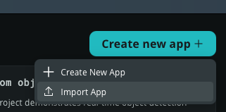
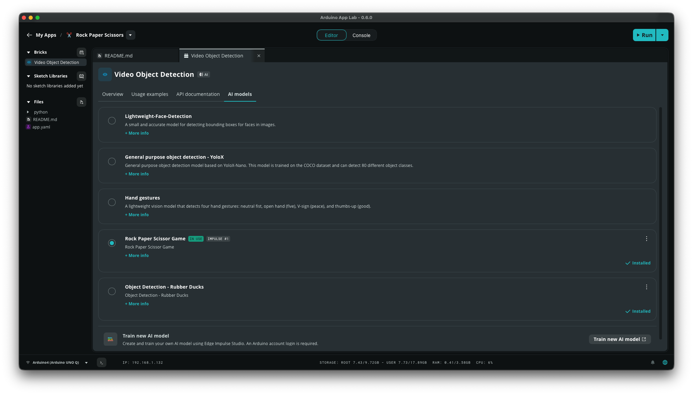
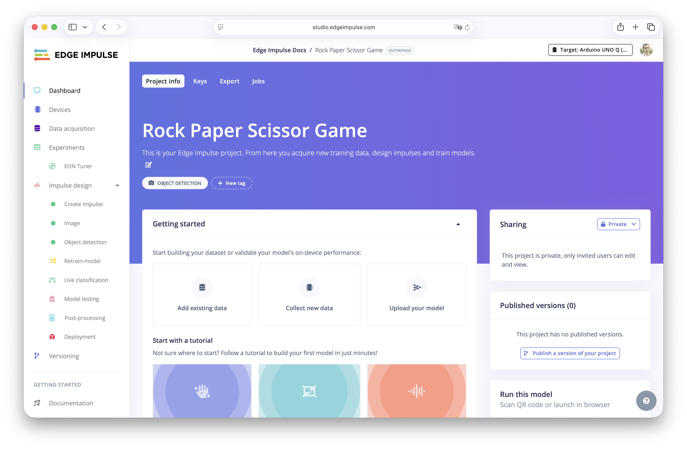
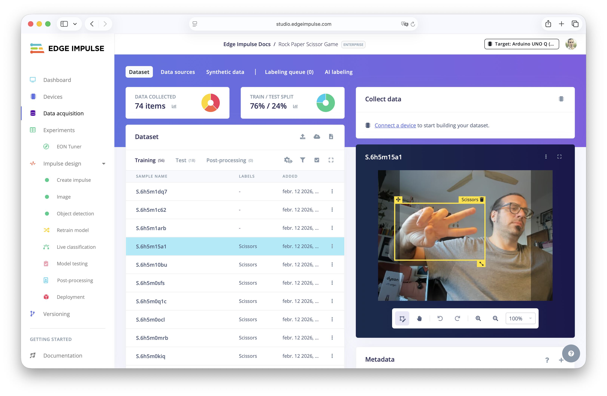
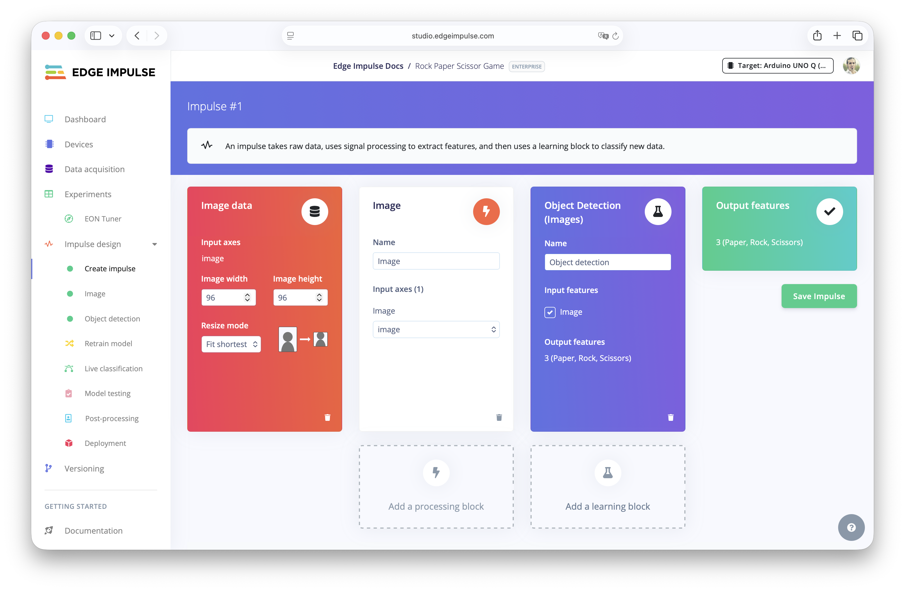
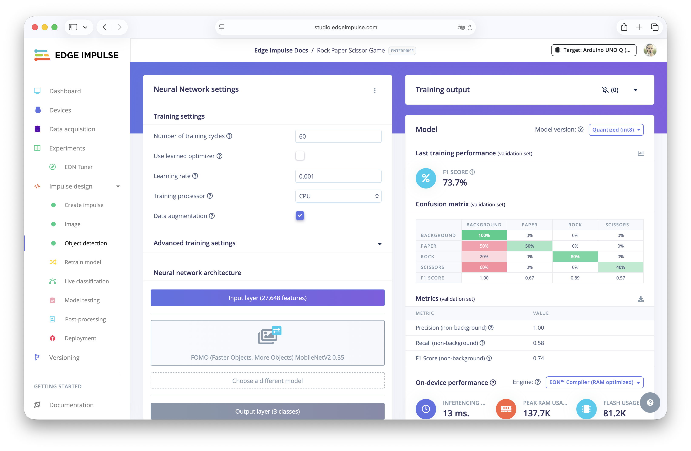
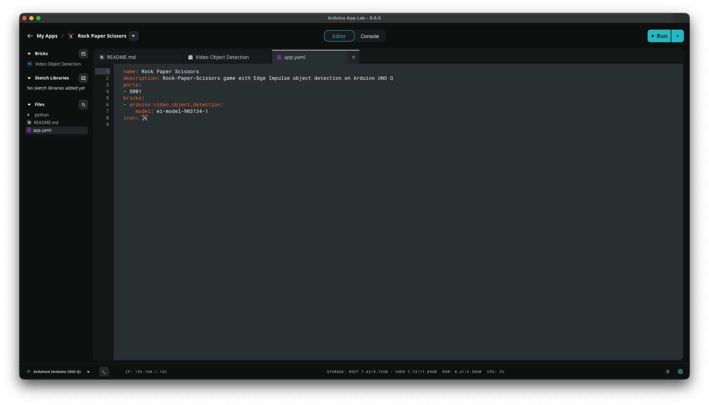

# Rock Paper Scissors — Arduino UNO Q

A real-time Rock-Paper-Scissors game running on the Arduino UNO Q using an Edge Impulse object detection model.


The camera detects your hand gesture (rock, paper, or scissors) via machine learning inference, while the Arduino picks a random move. Are you going to win the Arduino UNO Q?


## Deployment

### Prerequisites

- Arduino UNO Q with Arduino App Lab
- USB camera connected to the board
- [Edge Impulse](https://edgeimpulse.com/) machine learning model trained to detect `rock`, `paper`, and `scissors` as you can find in this public project [here](https://studio.edgeimpulse.com/public/903134/live). Clone it and re-train it to improve the accuracy with your light and background.

### Step 1: Transfer the App

Clone this repository to your local machine.

Copy the entire `Rock Paper Scissors` folder to the Arduino UNO Q board:

```bash
scp -r Rock-Paper-Scissors-Arduino-UNO-Q/ arduino@<device-ip>:/home/arduino/ArduinoApps/RPS-game
```

or use the Arduino App Lab `Create new App` button in the `My Apps` section and import the application.




### Step 2: Deploy the Model

Get into the `Rock Paper Scissor` app into the Arduino App Lab.

Click in the Brick `Video Object Detection` and then click `Train new AI model` in the bottom.



Log In into your Arduino account and the Edge Impulse account and then train your own `Rock Paper Scissors` model or clone [this public project](https://studio.edgeimpulse.com/public/903134/live) and re-train it.









Go to deploy the model as `Arduino UNO Q` or as `Linux aarch64`. 


Then the deployed models will appear in the brick of the Arduino App Lab when you will go to the `AI models` tab. Select the `Rock paper scissors` model.

And check that it's being added in the `app.yaml` file of the app.




### Step 3: Start the App

Launch the Arduino App Lab in your local machine and get into your Arduino UNO Q.

Go to `My Apps` and you may see the `Rock Paper Scissors` application there. Click on it and then click `Run`.

Alternatively, via SSH you can start the application using the Arduino App Lab CLI.

```bash
arduino-app-cli app start user:RPS-game
```

Once successfully started, navigate to `http://<device-ip>:5001` in your browser and start playing!


### Game Flow

1. Show your hand gesture (rock, paper, or scissors) to the camera.
2. The detection panel on the left shows what the model sees in real-time after running inference on a local object detection Edge Impulse model.
3. Click **Play Round** — your gesture is **locked in** at that moment.
4. The Arduino reveals its random move and the winner is shown


## Configuration

All settings are in [python/main.py](python/main.py) at the top:

| Setting | Default | Description |
|---------|---------|-------------|
| `CONFIDENCE_THRESHOLD` | `0.6` | Minimum confidence to accept a detection |
| `PORT` | `5001` | Flask web server port (also set `FLASK_PORT` env var) |
| `COUNTDOWN_SECS` | `3` | Countdown duration before evaluating |
| `RESULT_HOLD_SECS` | `3` | How long the result stays on screen |


### Changing the Model

In case that you want to create your own object detection model using [Edge Impulse](https://edgeimp.com/edgeai). 

Collect data, label it and train the neural network. Test it in Edge Impulse and when you will feel confident, deploy it in your computer as an Arduino UNO Q model (or Linux aarch64). 

Get the `eim` file  and copy it into the Arduino UNO Q.

```bash
scp new-model.eim arduino@<device-ip>:/home/arduino/.arduino-bricks/ei-models/
ssh arduino@<device-ip> "chmod +x /home/arduino/.arduino-bricks/ei-models/new-model.eim"
```

Edit `app.yaml` and update the `EI_OBJ_DETECTION_MODEL` path:

```yaml
bricks:
- arduino:video_object_detection: {
    variables: {
      EI_OBJ_DETECTION_MODEL: /home/arduino/.arduino-bricks/ei-models/new-model.eim
    }
  }
```


## Become an Edge Impulse expert

Want to learn more about how Edge Impulse ork? Try one of the [Edge Impulse courses](https://www.edgeimpulse.com/blog/introduction-to-edge-ai-course/). 


## Troubleshooting

**"No gesture detected" every round:**
- Check that the brick is initialized: look for `[BRICK] VideoObjectDetection initialized` in logs
- Check that `App.run()` is active: look for `[MODE] App runner: yes` in logs
- Look for `[BRICK-RAW]` lines — if absent, the brick callback isn't firing
- Ensure your model labels match `rock`, `paper`, `scissors` (lowercase)

**"App runner: no" in logs:**
- The `App` class couldn't be imported. Make sure you're running via `arduino-app-cli app start`, not `python3 main.py` directly

**Model not found:**
- Verify the `.eim` file exists at the path in `app.yaml`
- Ensure the file is executable: `chmod +x /home/arduino/.arduino-bricks/ei-models/rcp-model.eim`

Feel free to reach out to us on the [Edge Impulse forum](https://forum.edgeimpulse.com) or the [Edge Impulse Discord server](https://discord.gg/edgeimpulse) if you need help.


## Disclaimer

This project is intended for educational and experimental purposes only. It is not hardened for production use. Do not deploy in any safety-critical environments without proper security, testing, and validation.
